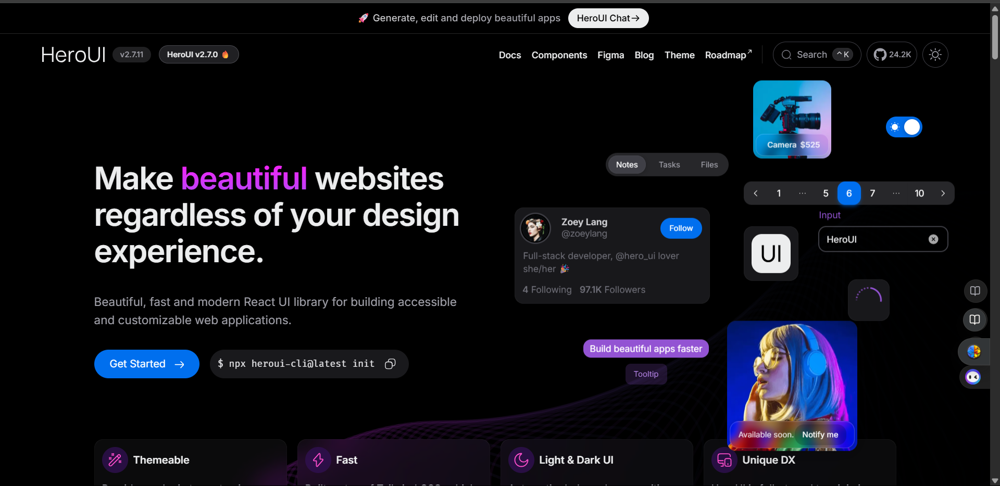

# 🌟 Modern UI & Design Resources Hub

A beautifully organized collection of modern UI resources, thoughtfully categorized for better discovery and usability.

---

## 📑 Table of Contents

- [🌟 Modern UI \& Design Resources Hub](#-modern-ui--design-resources-hub)
  - [📑 Table of Contents](#-table-of-contents)
  - [🎨 UI Libraries \& Components](#-ui-libraries--components)
  - [|  |	**Efferd** |Beautiful Shadcn/UI Blocks for Busy \& Smart devs  |	Visit |](#--efferd-beautiful-shadcnui-blocks-for-busy--smart-devs--visit-)
  - [🚀 Animation \& Interaction](#-animation--interaction)
  - [🎨 Design Systems](#-design-systems)
  - [🌈 Color \& Styling Tools](#-color--styling-tools)
  - [📚 Learning \& Documentation](#-learning--documentation)
  - [🛠 Development Tools](#-development-tools)
  - [✨ Icons \& Assets](#-icons--assets)
  - [🌐 Community Resources](#-community-resources)
  - [🧪 Experimental \& Cutting Edge](#-experimental--cutting-edge)
  - [📊 Data Visualization](#-data-visualization)
  - [🤖 AI-Powered Tools](#-ai-powered-tools)
  - [📱 Mobile-First UI](#-mobile-first-ui)
  - [🔧 Contribution Guide](#-contribution-guide)
    - [How to contribute:](#how-to-contribute)
    - [Screenshot guidelines:](#screenshot-guidelines)

---

## 🎨 UI Libraries & Components

Modern UI component libraries and kits for building beautiful interfaces

| Preview | Name | Description | Link |
| :--- | :--- | :--- | :--- |
|  | **Aceternity UI** | Beautiful, modern UI templates and components | [Visit](https://ui.aceternity.com/) |
|  | **21st UI** | Elegant components with minimal aesthetic | [Visit](https://21st.dev/) |
|  | **Starwind** | UI templates and kits for modern interfaces | [Visit](https://starwind.dev/) |
|  | **Smooth UI** | Clean React-based UI components | [Visit](https://www.smoothui.dev/) |
|  | **Reverse UI** | Interactive Tailwind components and patterns | [Visit](https://reverseui.com/) |
|  | **Hero UI** | Tailwind-friendly UI components | [Visit](https://www.heroui.com/) |
|  | **Origin UI** | Customizable components with pragmatic structure | [Visit](https://originui.com/) |
|  | **EasyUI** | Responsive React component library | [Visit](https://www.easyui.pro/) |
|  | **DaisyUI** | Tailwind CSS components with built-in themes | [Visit](https://daisyui.com/) |
|  | **HyperUI** | Free Tailwind component snippets and patterns | [Visit](https://www.hyperui.dev/) |
|  | **Ripple UI** | Lightweight Tailwind components | [Visit](https://www.ripple-ui.com/) |
|  | **MVP Blocks** | Prebuilt UI blocks for fast MVP shipping | [Visit](https://blocks.mvp-subha.me/) |
|  | **SHSF UI** | Motion-first UI library with attention to detail | [Visit](https://www.shsfui.com/) |
|  | **Skiper UI** | Components tailored for modern websites | [Visit](https://skiper-ui.com/) |
|  | **Kibo UI** | Tools to build responsive websites quickly | [Visit](https://www.kibo-ui.com/) |
|  | **Spectrum UI** | Copy-paste UI components for instant use | [Visit](https://ui.spectrumhq.in/) |
|  | **Sera UI** | Build beautiful websites with a simple toolkit | [Visit](https://seraui.seraprogrammer.com/) |
|  | **Kokonut UI** | 100+ Tailwind & shadcn components for React/Next.js | [Visit](https://kokonutui.com/) |
|  | **Stunning UI** | Tailwind components for Vue and Nuxt | [Visit](https://www.stunningui.design/) |
|  | **Nur UI** | Modern React/Next UI with CLI scaffolding | [Visit](https://nurui.vercel.app/) |
|  | **ScrollX UI** | Animated, handcrafted UI components | [Visit](https://scrollx-ui.vercel.app/) |
|  | **REUI** | Open-source animated components that pair with shadcn | [Visit](https://reui.io/) |
|  | **Tailark** | Shadcn UI blocks for marketing websites | [Visit](https://tailark.com/) |
|  | **Cult UI** | Shadcn-compatible blocks and Next.js templates | [Visit](https://www.cult-ui.com/) |
|  | **Flyon UI** | Tailwind CSS components with semantic classes | [Visit](https://flyonui.com/) |
|  | **Flowbite** | Components built on top of Tailwind CSS | [Visit](https://flowbite.com/) |
|  | **Preline UI** | Tailwind crafted UI components and plugins | [Visit](https://preline.co/) |
|  | **TailGrids** | Tailwind components, blocks, and templates | [Visit](https://tailgrids.com/) |
|  | **Meraki UI** | Ready-made Tailwind components | [Visit](https://merakiui.com/) |
|  | **Mamba UI** | Open-source Tailwind components and templates | [Visit](https://mambaui.com/) |
|  | **Orion UI** | Lightweight Vue UI framework | [Visit](https://orion-ui.org/) |
|  | **Basecoat UI** | Tailwind-based components that work with many stacks | [Visit](https://basecoatui.com/) |
|  | **Kutty** | Prebuilt Tailwind components and patterns | [Visit](https://kutty.netlify.app/) |
|  | **Myna UI** | Tailwind + shadcn UI kit for Figma and React | [Visit](https://mynaui.com/) |
|  | **Lina Adaptive Scroll Area** | Adaptive scroll area component for modern UIs | [Visit](https://lina.sameer.sh/) |
|  | **React Wheel Picker** | iOS-like wheel picker for React with smooth inertia | [Visit](https://react-wheel-picker.chanhdai.com/) |
|  | **Cook** | Ultra-modern bento UI using Next.js, PocketBase, shadcn/ui | [Visit](https://cook.engage-dev.com/) |
|  | **E-commerce UI** | UI library tailored for e-commerce sites & marketplaces | [Visit](https://ecommerce-ui.com/) |
|  |	**Forge UI** |	Production-ready UI components built with Tailwind CSS and React |	[Visit](https://forgeui.in/) |
|  |	**Lightswind** |	Minimal, lightweight UI component library built with Tailwind CSS |	[Visit](https://lightswind.com/) |
|  |	**Nuxt UI** |	Complete UI framework for Nuxt with 50+ components, icons, and modules |	[Visit](https://ui.nuxt.com/) |
|  |	**Devsloka UI** |	Free Tailwind CSS components and blocks for modern interfaces |	[Visit](https://ui.devsloka.in/) |
|  |	**Reka UI** |	Beautifully crafted Vue.js components with modern design |	[Visit](https://reka-ui.com/) |
|  |	**Intent UI** |Beautiful components and templates for React, Next.js & Tailwind CSS |	[Visit](https://intentui.com/) |
|  |	**Buttony UI** |Specialized collection of beautifully designed button components |	[Visit](https://buttonyui.com/) |
|  |	**Efferd** |Beautiful Shadcn/UI Blocks for Busy & Smart devs  |	[Visit](https://efferd.com/) |
---

## 🚀 Animation & Interaction

Libraries and tools for creating engaging animations and interactions

| Preview | Name | Description | Link |
| :--- | :--- | :--- | :--- |
|  | **Animate UI** | Pre-built, animated UI components | [Visit](https://animate-ui.com/) |
|  | **Magic UI** | Animations and micro-interactions for React | [Visit](https://magicui.design/) |
|  | **AnimeJS** | All-in-one JavaScript animation engine | [Visit](https://animejs.com/) |
|  | **Motion Primitives** | Motion-first primitives and kit for interfaces | [Visit](https://motion-primitives.com/) |
|  | **Tailwind CSS Animations** | Community-powered Tailwind animation plugin/docs | [Visit](https://tailwindcss-animations.vercel.app) |
|  | **Widget UI** | The first ever collection of Widgets for the Web. | [Visit](https://wigggle-ui.vercel.app/) |

---

## 🎨 Design Systems

Comprehensive design systems and foundational UI frameworks

| Preview | Name | Description | Link |
| :--- | :--- | :--- | :--- |
|  | **Headless UI** | Unstyled, accessible primitives for React/Vue | [Visit](https://headlessui.com/) |
|  | **Base Web** | Uber's design system and component library | [Visit](https://baseweb.design/) |
|  | **Radix UI** | Unstyled, accessible primitives for building systems | [Visit](https://www.radix-ui.com/) |
|  | **Ant Design** | Enterprise-grade React UI system | [Visit](https://ant.design/) |
|  | **ShadCN UI** | Tailwind + Radix based components and blocks | [Visit](https://ui.shadcn.com/) |
|  | **CoreUI** | Admin dashboard components and templates | [Visit](https://coreui.io/) |
|  | **Reshaped** | Professional design system for React with customizable components and Figma integration | [Visit](https://reshaped.so/) |
|  | **Radix Vue** | Unstyled, accessible components for Vue.js design systems | [Visit](https://www.radix-vue.com/) |

---

## 🌈 Color & Styling Tools

Tools for creating beautiful color palettes and styling systems

| Preview | Name | Description | Link |
| :--- | :--- | :--- | :--- |
|  | **UI Colors** | Generate Tailwind color palettes and tones | [Visit](https://uicolors.app/) |
|  | **ShadcnThemes** | Randomise and tailor shadcn themes | [Visit](https://shadcnthemes.vercel.app/) |
|  | **Tweakcn** | Theme and style tools for shadcn/ui | [Visit](https://tweakcn.com/) |

---

## 📚 Learning & Documentation

Educational resources, blogs, and documentation for UI design

| Name | Description | Link |
| :--- | :--- | :--- |
| **ReactBits** | Patterns and practices for React UI | [Visit](https://reactbits.dev/) |
| **Paul Lloyd's Blog** | Design systems and digital design | [Visit](https://paulrobertlloyd.com/) |
| **Chánh Đại** | Articles on development, design, and ideas | [Visit](https://chanhdai.com/) |
| **Modern React UI Libraries** | Blog on modern component kits | [Read](https://www.manishtamang.com/blog/modern-react-ui-component-libraries?) |
| **Components Work** | A directory of components and patterns | [Visit](https://components.work/) |
| **UiOrbit** | Hub to discover and compare frontend UI libraries | [Visit](https://ui-orbit.vercel.app/) |
| **Shadcn/ui Cheatsheet** | Quick reference guide for shadcn/ui components and usage | [Visit](https://shadcnstore.com/cheatsheet/) |

---

## 🛠 Development Tools

Tools and utilities to enhance your development workflow

| Preview | Name | Description | Link |
| :--- | :--- | :--- | :--- |
|  | **Shadcn Forms** | Build forms quickly with shadcn + react-hook-form + zod | [Visit](https://www.shadcn-form.com/) |
|  | **Shadcn Tiptap** | Custom extensions and toolbars for the Tiptap editor | [Visit](https://tiptap.niazmorshed.dev/) |
|  | **shadcn-prose** | Typographic plugin designed for shadcn/ui | [Visit](https://shadcn-prose.vercel.app/) |
|  | **Spaceman RTA** | Theme switching with smooth view transitions | [NPM](https://www.npmjs.com/package/@space-man/react-theme-animation?activeTab=readme) / [Visit](https://spaceman-rta-vite.netlify.app/) |

---

## ✨ Icons & Assets

Collections of icons, SVGs, and design assets

| Preview | Name | Description | Link |
| :--- | :--- | :--- | :--- |
|  | **Lucide Icons** | Open-source, consistent icon set | [Visit](https://lucide.dev/) |
|  | **Pattern Craft** | Beautiful backgrounds and patterns | [Visit](https://patterncraft.fun/) |
|  | **SVGL** | SVG logos library built with Sveltekit & Tailwind | [Visit](https://svgl.app/) |

---

## 🌐 Community Resources

Community-driven projects and collaborative resources

| Preview | Name | Description | Link |
| :--- | :--- | :--- | :--- |
|  | **UIverse** | Community-made CSS/React/Tailwind components | [Visit](https://uiverse.io/) |
|  | **Vue Bits** | Animated Vue components and bits | [Visit](https://vue-bits.dev/) |

---

## 🧪 Experimental & Cutting Edge

Innovative and forward-thinking UI projects

| Preview | Name | Description | Link |
| :--- | :--- | :--- | :--- |
|  | **V0** | Turn prompts into web apps with v0 platform | [Visit](https://v0.app/) |

---

## 📊 Data Visualization

Tools and libraries for creating beautiful data visualizations

| Preview | Name | Description | Link |
| :--- | :--- | :--- | :--- |
|  | **Evil Charts** | Animated chart UI built with shadcn & recharts | [Visit](https://evilcharts.com/) |

---

## 🤖 AI-Powered Tools

UI tools and components enhanced with artificial intelligence

| Preview | Name | Description | Link |
| :--- | :--- | :--- | :--- |
|  | **AI Elements** | Component registry for AI-native UI on shadcn/ui | [Visit](https://ai-sdk.dev/elements/overview) |

---

## 📱 Mobile-First UI

UI libraries and components designed for mobile experiences

| Preview | Name | Description | Link |
| :--- | :--- | :--- | :--- |
|  | **CrossBuild UI** | React Native UI components optimized for Expo | [Visit](https://www.crossbuildui.com/) |

---

## 🔧 Contribution Guide

We welcome contributions to make this resource list even more valuable!

### How to contribute:
1. Fork the repository
2. Add your resource to the appropriate category
3. Include a 120px wide preview image in the `images/` folder
4. Use the format:  
   ```html
   |  | Name | Description | [Visit](link) |
   ```
5. Submit a pull request with a brief description of your addition

### Screenshot guidelines:
- Ideal size: 1200x630 pixels for nice previews
- Save to the `images/` folder with a descriptive filename
- Use the HTML image tag format shown in the tables

---

*Maintained with ❤️ by [Al-Hussein](https://www.al-husayn.dev/)*